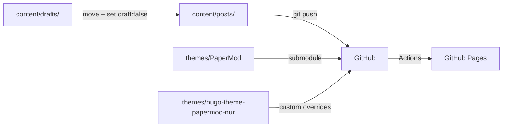

# ABOUTME: Blog project retrospective capturing publishing workflow, decisions, and gotchas
# ABOUTME: Living document updated after significant blog infrastructure changes

# Maroffo Blog - Learning Documentation

## Project Overview

Hugo blog (PaperMod theme) hosted on GitHub Pages. Content ranges from AI-assisted development deep-dives to opinion pieces on engineering culture. Published ~20 posts since Jan 2023, with acceleration in 2026 (claude-forge series, AI opinion pieces).

## Architecture

## Tech Stack & Decisions

| Technology | Why | Trade-offs |
|------------|-----|------------|
| Hugo + PaperMod | Fast, markdown-native, good code block support | Theme as git submodule can break on clone |
| GitHub Pages | Free, auto-deploy on push | No server-side features |
| Pagefind | Client-side search, no backend needed | Build step adds indexing time |
| Two themes layered | Custom overrides in papermod-nur, base in PaperMod | Merge order matters in hugo.toml |
| content/drafts/ (gitignored) | Drafts never reach GitHub | Can't collaborate on drafts via GitHub |

## Lessons Learned

### 2026-03-31: Draft Separation and Publish Safety

**Context:** Several posts with `draft: true` were being pushed to GitHub. While Hugo doesn't render them in the published site, the markdown source was publicly visible in the repo.

**Problem:** No separation between work-in-progress and published content. Five drafts sitting in `content/posts/` alongside published articles. Any `git push` sent them to the public repo.

**Solution:** Two-layer protection:

1. **Directory convention:** drafts live in `content/drafts/` (gitignored). When ready, physically move to `content/posts/` and set `draft: false`. Important: never use `git mv` to move drafts, because `.gitignore` only ignores *untracked* files. Use `mv` (or your file manager), then `git add` the new file.

2. **Pre-commit hook:** `.githooks/pre-commit` (tracked, portable) scans the git *index* (not the working tree) for staged files in `content/posts/` with `draft: true`. Blocks the commit with a clear error message. Uses `git show ":$file"` to read staged content, so it catches the exact version being committed. After cloning, run: `git config core.hooksPath .githooks`.

**Takeaways:**

- Git submodules for themes need `git submodule update --init --recursive` after cloning. Hugo serves 404 on every page if the theme layouts are missing, with no clear error message; just a wall of "found no layout file" warnings.

- The pre-commit hook lives in `.git/hooks/` (not tracked by git). If Max clones the repo on a new machine, the hook won't be there. Consider adding a `scripts/setup-hooks.sh` or using a framework like pre-commit in the future.

- Cover images are generated with `_generate_image.py` (Gemini). The script now loads `~/.env` as fallback for `GEMINI_API_KEY`, so it works without manual `export`.

### 2026-03-31: Post #5 - Meta-Harness Blog Post

**Context:** Fifth post in the claude-forge series. Applied Meta-Harness paper concepts.

**Problem:** Writing about infrastructure you just built means the implementation is fresh but the narrative distance is zero. Easy to fall into "here's what I did" without the "here's why it matters."

**Solution:** Gemini second-opinion review caught: AI writing artifacts ("doing a lot of work", apologetic ending), missing overfitting discussion, missing optimizer cost/benefit. The rewrite added concrete safeguards (pinned rules, deterministic heuristic scripts as middle ground) and a sharper ending.

**Takeaway:** The second-opinion step on blog posts is as valuable as on code. Gemini's editorial feedback is different from Claude's: it catches tone inconsistencies and structural weaknesses that the author (human or AI) is too close to see.

### 2026-06-15: "A Billion in Beds" - bilingual variants, fact-checking a viral source, and editing drift

**Context:** A data-heavy opinion piece replying to a viral Facebook post about Sardinia's economy (tourism is the top non-oil export but the lowest-productivity sector). Published as two posts, English and Italian.

**Bilingual convention, now settled:** the blog is single-language in `hugo.toml` (no i18n), so a language variant is just another post file with its own slug. The two posts share **one** cover image, because the covers carry no text (black-and-white ink sketch). `cover-a-billion-in-beds.png` is referenced by both front matters. One image, two posts, zero duplication.

**Never trust the numbers you are handed, even from a good source.** The viral post was well argued, and almost every figure in it needed a caveat or a correction once checked against the primary source:
- The ISTAT "99,015 productivity / 17,709 income" numbers are **national tourism-sector** figures, not Sardinian. The source implied they were local. We kept them but said so, and added that Sardinia's hyper-seasonal, lodging-heavy mix is likely *worse* than the national average.
- The source's precise export breakdown (chemicals 282M, dairy 161M) did not match ISTAT (chemicals ~177M in 2023). We dropped the exact figures and stated a defensible aggregate instead ("the whole non-oil export base is under 1.2bn").
- "Beach disease" (Holzner, 2011) is a real coined term whose author found *little* cross-country evidence for it. Presented as a hypothesis, not a finding.

**Manual rewrites regress, so re-check after every hand-edit.** After the AI draft was reviewed and tightened, the author hand-rewrote both posts, and two factual slips crept back *in* during the manual pass: "44,000 families" became "43,000" (Quarantatremila) in one sentence, and the CRENoS "96% micro-firms / 60% of all jobs" stat got narrowed to "tourism companies" when it is economy-wide. A human rewrite needs the same consistency pass as the AI draft. After any hand-edit round, re-grep the post for its numbers and named entities.

**Adversarial review earns its keep on opinion pieces.** Two isolated-reviewer rounds (Claude + Gemini in Docker) plus a tightening round caught the things the author could not see: a missing Costa Smeralda concession that undercut the "lowest value" claim, and a logical tension (attacking the 44k-families rental model while elsewhere praising "value that stays"). The fix was conceptual, not cosmetic: distinguish *retaining* a euro from *compounding* one. "Resilient is not the same as rich."

**Takeaway:** for research-backed posts, the credibility is in the footnotes. The methodology note that says "I checked every figure" only earns trust if you actually did, including after the last human edit.

### 2026-07-13: "18 Retrospectives" - review the outline, not just the draft

**Context:** Post about the learning-loop skill (mining 18 LEARNING.md files into harness changes). Max asked for positioning check + external research + second-opinion *before* drafting.

**Problem:** The planned thesis was "recurrence across repos = process bug". Three isolated reviewers (Claude, Gemini, DeepSeek), given only the outline, unanimously found the hole: 18 retrospectives from one operator's repos are correlated output, so recurrence measures *my* blind spots, not the industry's process bugs. They also converged on structure ("put the honesty next to the counting rules, not in a closing mea culpa") and on deflating the "loop said no to itself" beat (credit the falsification-row format, not the model's "wisdom").

**Solution:** Reshaped the thesis before writing a single paragraph: narrower claim ("this is how I fail, on the record, repeatedly"), stated early in a dedicated section. The draft needed zero structural rewrites afterward.

**Takeaway:** Adversarial review of the *outline* is dramatically cheaper than of the draft: a thesis-level flaw caught pre-draft costs one section plan; caught post-draft it costs a rewrite. 3/3 independent agreement on the same objection is a "you're wrong, fix it" signal, not a data point to weigh. (All three also preferred a different title; kept the author's choice, it's his call.)

### 2026-07-13: Verify your own telemetry like an external source

**Context:** The post title claims "18 retrospectives". The learning-loop report said "22 LEARNING.md files"; the corpus on disk had 20 distinct sources; 2 of those were the same repos at pre/post-monorepo paths.

**Problem:** Three different counts for the same fact, all "mine". Publishing any of them unverified would have been the exact sin two previous posts ("A Billion in Beds", "The Word Permanent") called out in others.

**Solution:** Recomputed everything from the corpus JSONL directly (20 sources, collapse 2 migration duplicates, 18 real files) and used only numbers re-derivable from artifacts on disk. Same discipline killed an external claim: the "70-80% of retro action items never implemented" figure circulating on agile blogs is unsourceable; reading the actual paper (Dingsøyr et al., XP 2018, arXiv:1805.10310) gave a sharper, citable finding instead (6 of 36 action items addressed anything beyond team level).

**Takeaway:** Numbers from your own reports age and drift like anyone else's. If the artifact can be recounted, recount it; if a web figure has no primary source, go read the paper. Bonus gotcha: WebFetch cannot parse arXiv PDFs, but it saves the binary to the session tool-results directory, and Read with a page range extracts it fine.

## Pitfalls & Gotchas

- **Hugo submodule empty after clone.** `themes/PaperMod/` shows as empty directory. Hugo builds 42 pages but every route returns 404. Fix: `git submodule update --init --recursive`.

- **Pre-commit hook portability.** Solved by using `.githooks/` (tracked directory) + `git config core.hooksPath .githooks`. Needs to be run once after cloning.

- **`_generate_image.py` needs GEMINI_API_KEY.** Gemini CLI reads its own config, but the Python script reads `os.environ`. Fixed: script now tries `~/.env` as fallback.

- **Hugo draft flag is case-insensitive** (both `draft: true` and `Draft: True` work). The pre-commit hook uses `grep -Eqi` to match all YAML variations.

- **Theme submodule not populated on a fresh branch/worktree = silent half-build.** Same root cause as the empty-submodule-after-clone gotcha, but sneakier: `make check` / `hugo` exit 0 and write `public/`, yet render **no single post pages** (only home, list pages, and `index.xml`). The build "passes," so you think you are fine. Spotted it when `find public -name '*billion*'` came back empty after a successful build. Two practical consequences: (1) fix real rendering with `git submodule update --init --recursive`; (2) if you only need a post's canonical URL and the single pages are not rendering, read it straight from `public/posts/index.xml` (the RSS `<link>`), which builds even without the theme.

- **A branch created from `origin/main` tracks `main`, so a bare `git push` can target main.** `git checkout -b post/foo origin/main` sets the upstream to `origin/main`. A plain `git push` would then try to push to main. Always push to the branch's own ref explicitly: `git push -u origin post/foo:post/foo`. The main-branch guard catches *commits* on main, not necessarily a push to it, so do not rely on it here.

- **Em dashes sneak back in through quoted material.** Quoting my own recurrence report inside the post reintroduced an em dash the report legitimately contains. The no-em-dash rule applies to every character that renders, quotes and code-block excerpts of prose included; rewrite the quote's punctuation (colon) rather than reproducing it. Final check: `grep -n "—" <post>` must return nothing.

- **Post-publish verification must use the real baseURL.** The site lives under `https://maroffo.github.io/blog/`, not at the github.io root. A naive `curl` to `/posts/<slug>/` returns 404 even when the deploy succeeded, which looks exactly like a broken deploy. Derive the check URL from `baseURL` in `hugo.toml`, then expect 200.

## Best Practices Discovered

- **Draft workflow:** write in `content/drafts/`, preview with `hugo server --buildDrafts`, move to `content/posts/` + `draft: false` when ready. Pre-commit hook catches mistakes.

- **Series posts benefit from reading previous installments before writing.** Each post references 2-3 previous ones. Reading them before writing avoids repeating the same explanations and enables callbacks that series readers appreciate.

- **Gemini as editorial reviewer, Claude as structural writer.** Claude drafts the structure and content, Gemini reviews for tone, logic gaps, and AI artifacts. Different models catch different things.
