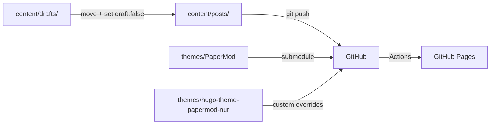

# ABOUTME: Blog project retrospective capturing publishing workflow, decisions, and gotchas
# ABOUTME: Living document updated after significant blog infrastructure changes

# Maroffo Blog - Learning Documentation

## Project Overview

Hugo blog (PaperMod theme) hosted on GitHub Pages. Content ranges from AI-assisted development deep-dives to opinion pieces on engineering culture. Published ~20 posts since Jan 2023, with acceleration in 2026 (claude-forge series, AI opinion pieces).

## Architecture

## Tech Stack & Decisions

| Technology | Why | Trade-offs |
|------------|-----|------------|
| Hugo + PaperMod | Fast, markdown-native, good code block support | Theme as git submodule can break on clone |
| GitHub Pages | Free, auto-deploy on push | No server-side features |
| Pagefind | Client-side search, no backend needed | Build step adds indexing time |
| Two themes layered | Custom overrides in papermod-nur, base in PaperMod | Merge order matters in hugo.toml |
| content/drafts/ (gitignored) | Drafts never reach GitHub | Can't collaborate on drafts via GitHub |

## Lessons Learned

### 2026-03-31: Draft Separation and Publish Safety

**Context:** Several posts with `draft: true` were being pushed to GitHub. While Hugo doesn't render them in the published site, the markdown source was publicly visible in the repo.

**Problem:** No separation between work-in-progress and published content. Five drafts sitting in `content/posts/` alongside published articles. Any `git push` sent them to the public repo.

**Solution:** Two-layer protection:

1. **Directory convention:** drafts live in `content/drafts/` (gitignored). When ready, physically move to `content/posts/` and set `draft: false`. Important: never use `git mv` to move drafts, because `.gitignore` only ignores *untracked* files. Use `mv` (or your file manager), then `git add` the new file.

2. **Pre-commit hook:** `.githooks/pre-commit` (tracked, portable) scans the git *index* (not the working tree) for staged files in `content/posts/` with `draft: true`. Blocks the commit with a clear error message. Uses `git show ":$file"` to read staged content, so it catches the exact version being committed. After cloning, run: `git config core.hooksPath .githooks`.

**Takeaways:**

- Git submodules for themes need `git submodule update --init --recursive` after cloning. Hugo serves 404 on every page if the theme layouts are missing, with no clear error message; just a wall of "found no layout file" warnings.

- The pre-commit hook lives in `.git/hooks/` (not tracked by git). If Max clones the repo on a new machine, the hook won't be there. Consider adding a `scripts/setup-hooks.sh` or using a framework like pre-commit in the future.

- Cover images are generated with `_generate_image.py` (Gemini). The script now loads `~/.env` as fallback for `GEMINI_API_KEY`, so it works without manual `export`.

### 2026-03-31: Post #5 - Meta-Harness Blog Post

**Context:** Fifth post in the claude-forge series. Applied Meta-Harness paper concepts.

**Problem:** Writing about infrastructure you just built means the implementation is fresh but the narrative distance is zero. Easy to fall into "here's what I did" without the "here's why it matters."

**Solution:** Gemini second-opinion review caught: AI writing artifacts ("doing a lot of work", apologetic ending), missing overfitting discussion, missing optimizer cost/benefit. The rewrite added concrete safeguards (pinned rules, deterministic heuristic scripts as middle ground) and a sharper ending.

**Takeaway:** The second-opinion step on blog posts is as valuable as on code. Gemini's editorial feedback is different from Claude's: it catches tone inconsistencies and structural weaknesses that the author (human or AI) is too close to see.

## Pitfalls & Gotchas

- **Hugo submodule empty after clone.** `themes/PaperMod/` shows as empty directory. Hugo builds 42 pages but every route returns 404. Fix: `git submodule update --init --recursive`.

- **Pre-commit hook portability.** Solved by using `.githooks/` (tracked directory) + `git config core.hooksPath .githooks`. Needs to be run once after cloning.

- **`_generate_image.py` needs GEMINI_API_KEY.** Gemini CLI reads its own config, but the Python script reads `os.environ`. Fixed: script now tries `~/.env` as fallback.

- **Hugo draft flag is case-insensitive** (both `draft: true` and `Draft: True` work). The pre-commit hook uses `grep -Eqi` to match all YAML variations.

## Best Practices Discovered

- **Draft workflow:** write in `content/drafts/`, preview with `hugo server --buildDrafts`, move to `content/posts/` + `draft: false` when ready. Pre-commit hook catches mistakes.

- **Series posts benefit from reading previous installments before writing.** Each post references 2-3 previous ones. Reading them before writing avoids repeating the same explanations and enables callbacks that series readers appreciate.

- **Gemini as editorial reviewer, Claude as structural writer.** Claude drafts the structure and content, Gemini reviews for tone, logic gaps, and AI artifacts. Different models catch different things.
